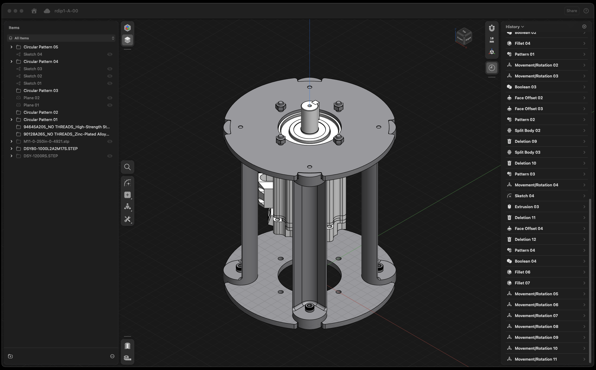
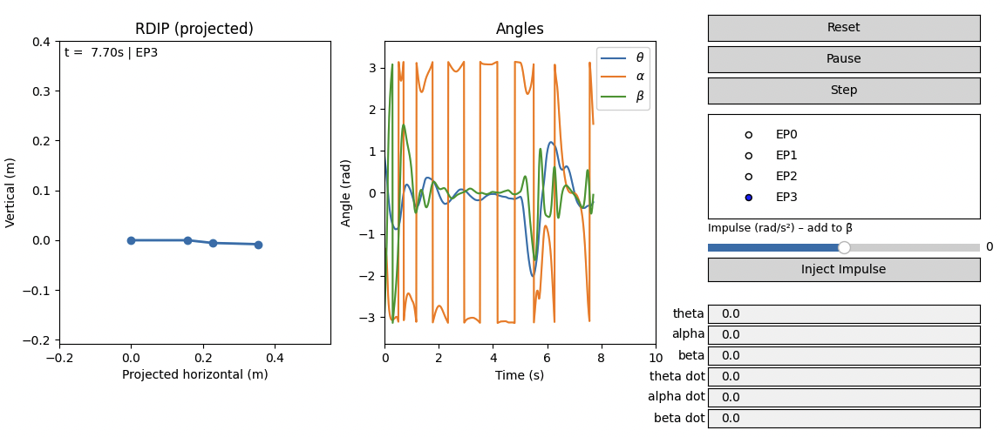

# Purpose
This is an implementation of "Sim-to-Real Reinforcement Learning for a Rotary Double-Inverted Pendulum Based on a Mathematical Model" from Machines 2025, 13, 186. Paper here: https://www.mdpi.com/2227-7390/13/12/1996

All hardware design and software was done from scratch independent of the researchers.

# Current State of Hardware Design - 10/16/2025


# RDIP TQC Training

This project recreates the **“Sim-to-Real Reinforcement Learning for a Rotary Double-Inverted Pendulum”** controller using the Truncated Quantile Critics (TQC) algorithm. The repo contains:

- `train_rdip_tqc.py`: main training loop (PyTorch); saves TensorBoard logs and per-episode rollouts.
- `rdip_env.py`: rotary double-inverted pendulum simulator derived directly from the paper.
- `tqc.py`: TQC implementation (actor, critics, replay buffer).
- `animate_latest_episode.py`: visualizes saved episodes as 2D animations.
- `interactive_sim.py`: interactive viewer for TorchScript actors with disturbance injection.

The instructions below walk through installation, running training, monitoring progress, animating episodes, using the interactive simulator, and using the exported actors (`rdip_tqc_actor_<timestamp>.pt`).

---

## 1. Setup & Dependencies

```bash
# Clone and enter workspace
git clone <repo-url>
cd rdip

# Create an isolated virtual environment
python3 -m venv .venv
source .venv/bin/activate

# Upgrade packaging tools (recommended)
python -m pip install --upgrade pip setuptools wheel

# Install runtime dependencies
python -m pip install torch numpy matplotlib tensorboard pypdf

# (Optional) install uv for faster dependency management
python -m pip install uv
```

**Note:** If you are running on macOS and encounter `pip` / permission errors, prefer using the venv steps above and avoid `pip install --user`. On CUDA machines, verify that your PyTorch install matches the desired CUDA version.

---

## 2. Running Training

Activate the virtual environment and launch the trainer:

```bash
source .venv/bin/activate
python train_rdip_tqc.py
```

Key defaults:
- `total_steps=6_500_000` (≈6,500 episodes, 10 s each at 10 ms control intervals).
- Episode transitions cycle through equilibrium modes EP0–EP3 to match the paper.
- TensorBoard logs write to `runs/TQC_<timestamp>_seed<seed>/`.
- Each completed episode is archived as `episode_XXXXX.npz` for later visualization.
- The latest policy exports to `rdip_tqc_actor_<timestamp>.pt` (timestamped TorchScript actor).

Override any training argument by calling `train(total_steps=..., seed=...)` within a short script or REPL.

---

## 3. Visualizing Episodes

During training the loop saves the most recent rollout to `runs/<run_dir>/latest_episode.npz` and archives every episode as `episode_00001.npz`, `episode_00002.npz`, ….

Use the animation helper to replay a specific episode:

```bash
source .venv/bin/activate
# Point MPLCONFIGDIR to a writable cache if Matplotlib complains about ~/.matplotlib
MPLCONFIGDIR=/tmp/matplotlib python animate_latest_episode.py \
    --run runs/TQC_20251012-231308_seed42 \
    --episode 5
```

Flags:
- `--run <path>`: run directory (defaults to newest folder in `runs/`).
- `--episode N`: zero-based or integer episode index; the script automatically converts to `episode_0000N.npz`.
- `--path <file.npz>`: specify a file directly.
- `--loop`: keep watching the `latest_episode.npz` file and re-display as new episodes complete.

The viewer shows a side-view stick figure plus angle traces over time.

---

## 4. Monitoring with TensorBoard

TensorBoard logs are stored per training run under `runs/TQC_<timestamp>_seed<seed>/`.

Launch TensorBoard in another terminal:

```bash
source .venv/bin/activate
tensorboard --logdir runs
```

Navigate to the printed URL (typically http://localhost:6006). You can track:

- `train/q_loss`, `train/pi_loss`: critic and policy losses.
- `train/alpha`, `train/entropy`: auto-temperature statistics.
- `episode/return`, `episode/ema_return`: raw/EMA episode returns.
- `episode/mode`: equilibrium mode index per episode.

---

## 5. Using the Exported Policy (`rdip_tqc_actor_<timestamp>.pt`)

At the end of each training run the script saves the actor network as a TorchScript file:

```bash
source .venv/bin/activate
python train_rdip_tqc.py  # produces rdip_tqc_actor_<timestamp>.pt
```

To load and run the policy:

```python
import torch
from rdip_env import RDIPEnv

actor = torch.jit.load("rdip_tqc_actor_20251012-231308.pt")
actor.eval()

env = RDIPEnv(seed=0)
obs = env.reset(ep_mode=0)   # 10-D observation: sin/cos angles, velocities, EP context
with torch.no_grad():
    action = actor(torch.tensor(obs).unsqueeze(0))[0]  # returns 1-D torque command
```

You can step the simulation manually or integrate the actor into a control stack. For deployment, ensure the observation ordering matches `RDIPEnv._obs()` and feed the resulting angular acceleration into hardware or a higher fidelity simulator.

If you wish to keep multiple checkpoints, simply keep the timestamped `.pt` files that training produces.

---

## 6. Interactive Simulation


Use `interactive_sim.py` to explore trained policies with visual feedback and disturbance injection:

```bash
source .venv/bin/activate
python interactive_sim.py --actor rdip_tqc_actor_<timestamp>.pt
```

Highlights:
- Reset / Pause / Step buttons manage playback.
- EP radio buttons change the target equilibrium context fed to the policy.
- The impulse slider applies a one-step angular acceleration to the second link (β̈).
- Text boxes set the initial angles / velocities for the next reset.

If Matplotlib complains about cache directories, set `MPLCONFIGDIR`, e.g.:

```bash
MPLCONFIGDIR=/tmp/mpl python interactive_sim.py --actor rdip_tqc_actor_<timestamp>.pt
```

The simulator assumes the TorchScript actor takes the observation tensor only; adjust the call if your export returns additional values (e.g., `(action, log_prob)`).
