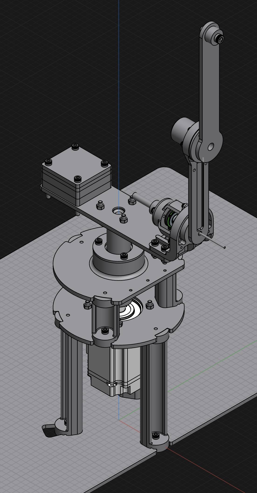

# Purpose
This is an implementation of "Sim-to-Real Reinforcement Learning for a Rotary Double-Inverted Pendulum Based on a Mathematical Model" from Machines 2025, 13, 186. Paper here: https://www.mdpi.com/2227-7390/13/12/1996

All hardware design and software was done from scratch independent of the researchers.

# Hardware - Revision 0


# CAD
Git doesn't support files greater than 100 MB without LFS, so the STEP file in the CAD directory is split into multiple files that you need to import piecemeal. 

# RDIP TQC Training

This project recreates the **“Sim-to-Real Reinforcement Learning for a Rotary Double-Inverted Pendulum”** controller using the Truncated Quantile Critics (TQC) algorithm. The repo contains:

- `train_rdip_tqc.py`: main training loop (PyTorch); spins up 1–16 simulators, warms up with random actions, logs to TensorBoard, and stores per-episode rollouts.
- `rdip_env.py`: rotary double-inverted pendulum simulator derived directly from the paper (17-D observation, actions are θ̈ in ±50 rad/s², 10 s episodes, Eq. (16) reward).
- `tqc.py`: Truncated Quantile Critics implementation (actor, critic ensemble, replay buffer, SAC-style temperature tuning).
- `tests/animate_latest_episode.py`: visualizes saved episodes as 2D animations (pendulum projection + angle traces).
- `tests/interactive_sim.py`: interactive viewer for TorchScript actors with disturbance injection and manual state resets.
- `io/io_dsy.py`: Modbus helper for DSY-RS servo drives (zeroing, jog, status).
- `runtime/runtime_actor.py`: optimized TorchScript wrapper for deployment targets.
- `runtime/runtime.py`: production control loop for hardware or simulated runs.

The instructions below walk through installation, running training, monitoring progress, animating episodes, using the interactive simulator, and using the exported actors (`rdip_tqc_actor_<timestamp>.pt`).

---

## Environment Snapshot

- **State vector (`RDIPEnv._obs`)**:  
  `sin/cos` of θ, α, β (6 values) + angular rates (3) + `sin/cos` of target α\*, β\* (4) + `sin/cos` of wrapped errors (4) ⇒ 17 floats.
- **Action**: scalar θ̈ command clipped to `[-50, 50]` rad/s².
- **Integration**: RK4 at 1 ms internal steps, control interval 10 ms, 10 s episode horizon (1 000 env steps).
- **Reward**: multiplicative shaping from Eq. (16) in the paper (penalizes torque magnitude and deviation from EP target).

With Numba installed the simulator automatically uses the compiled integrator; otherwise it falls back to a pure NumPy implementation.

---

## 1. Setup & Dependencies

```bash
# Clone and enter workspace
git clone <repo-url>
cd rdip

# Create an isolated virtual environment
python3 -m venv .venv
source .venv/bin/activate

# Upgrade packaging tools (recommended)
python -m pip install --upgrade pip setuptools wheel

# Install runtime dependencies
python -m pip install torch numpy matplotlib tensorboard pypdf

# (Recommended) enable JIT simulator speedups
python -m pip install numba

# (Optional) install uv for faster dependency management
python -m pip install uv
```

**Note:** If you are running on macOS and encounter `pip` / permission errors, prefer using the venv steps above and avoid `pip install --user`. On CUDA machines, verify that your PyTorch install matches the desired CUDA version.

---

## 2. Running Training

Activate the virtual environment and launch the trainer:

```bash
source .venv/bin/activate
python train_rdip_tqc.py
```

Key defaults:
- `total_steps=6_500_000` (≈6,500 episodes, 10 s each at 10 ms control intervals).
- 10k warm-up steps use exploratory random torques before the policy begins acting.
- Automatic parallel rollout: detects available CPU cores and spins up to 16 envs when running on CUDA.
- Episode transitions cycle through equilibrium modes EP0–EP3 to match the paper; per-mode return stats are logged.
- TensorBoard logs write to `runs/TQC_<timestamp>_seed<seed>/`.
- Each completed episode is archived as `episode_XXXXX.npz` (states, actions, rewards, params) plus a live `latest_episode.npz`.
- The latest policy exports to `rdip_tqc_actor_<timestamp>.pt` (timestamped TorchScript actor).

Override any training argument by calling `train(total_steps=..., seed=...)` within a short script or REPL.

---

## 3. Visualizing Episodes

During training the loop saves the most recent rollout to `runs/<run_dir>/latest_episode.npz` and archives every episode as `episode_00001.npz`, `episode_00002.npz`, ….

Use the animation helper to replay a specific episode:

```bash
source .venv/bin/activate
# Point MPLCONFIGDIR to a writable cache if Matplotlib complains about ~/.matplotlib
MPLCONFIGDIR=/tmp/matplotlib python tests/animate_latest_episode.py \
    --run runs/TQC_20251012-231308_seed42 \
    --episode 5
```

Flags:
- `--run <path>`: run directory (defaults to newest folder in `runs/`).
- `--episode N`: zero-based or integer episode index; the script automatically converts to `episode_0000N.npz`.
- `--path <file.npz>`: specify a file directly.
- `--loop`: keep watching the `latest_episode.npz` file and re-display as new episodes complete.
- Each archive contains arrays for `time`, `state` (θ, α, β, θ̇, α̇, β̇), `action`, `reward`, and the episode `mode`; the environment parameters are bundled for reproducibility.

The viewer shows a side-view stick figure plus angle traces over time.

---

## 4. Monitoring with TensorBoard

TensorBoard logs are stored per training run under `runs/TQC_<timestamp>_seed<seed>/`.

Launch TensorBoard in another terminal:

```bash
source .venv/bin/activate
tensorboard --logdir runs
```

Navigate to the printed URL (typically http://localhost:6006). You can track:

- `train/q_loss`, `train/pi_loss`: critic and policy losses.
- `train/alpha`, `train/entropy`: auto-temperature statistics.
- `episode/return`, `episode/ema_return`: raw/EMA episode returns.
- `episode/mode`: equilibrium mode index per episode.

---

## 5. Using the Exported Policy (`rdip_tqc_actor_<timestamp>.pt`)

At the end of each training run the script saves the actor network as a TorchScript file:

```bash
source .venv/bin/activate
python train_rdip_tqc.py  # produces rdip_tqc_actor_<timestamp>.pt
```

To load and run the policy:

```python
import torch
from rdip_env import RDIPEnv

actor = torch.jit.load("rdip_tqc_actor_20251012-231308.pt")
actor.eval()

env = RDIPEnv(seed=0)
obs = env.reset(ep_mode=0)   # 17-D observation: sin/cos angles, velocities, targets, errors
with torch.no_grad():
    action_out = actor(torch.tensor(obs).unsqueeze(0))
    if isinstance(action_out, (tuple, list)):
        action = action_out[0]
    else:
        action = action_out
    action = action.squeeze(0)
torque = float(action.item())  # final torque command in rad/s²
```

You can step the simulation manually or integrate the actor into a control stack. For deployment, ensure the observation ordering matches `RDIPEnv._obs()` and feed the resulting angular acceleration into hardware or a higher fidelity simulator.
Clamp the command to `[-env.max_action, env.max_action]` before calling `env.step(torque)`.

If you wish to keep multiple checkpoints, simply keep the timestamped `.pt` files that training produces.

---

## 6. Interactive Simulation


Use `tests/interactive_sim.py` to explore trained policies with visual feedback and disturbance injection:

```bash
source .venv/bin/activate
python tests/interactive_sim.py --actor rdip_tqc_actor_<timestamp>.pt
```

Highlights:
- Reset / Pause / Step buttons manage playback.
- EP radio buttons change the target equilibrium context fed to the policy.
- The impulse slider applies a one-step angular acceleration to the second link (β̈).
- Text boxes set the initial angles / velocities for the next reset.
- CLI flags: `--history` adjusts the plotted time window, `--disturbance` rescales the impulse slider limits.

If Matplotlib complains about cache directories, set `MPLCONFIGDIR`, e.g.:

```bash
MPLCONFIGDIR=/tmp/mpl python tests/interactive_sim.py --actor rdip_tqc_actor_<timestamp>.pt
```

The simulator assumes the TorchScript actor's first return value is the action tensor; adjust `_simulation_step` if your export has a different signature.

---

## 7. Runtime Deployment (RPi / Embedded)

The `runtime/` directory hosts the deployment stack:

- `runtime/runtime_actor.py`: loads and optimizes the TorchScript actor for low-latency inference and exposes helpers to build the 17‑D observation from encoder data.
- `runtime/runtime.py`: production entrypoint that can either run against real hardware (encoders/motor driver stubs included) or simulate the loop end-to-end by toggling `--simulate`.

Example hardware usage (Modbus over RS-485):

```bash
python runtime/runtime.py \n    --actor rdip_tqc_actor_<timestamp>.pt \n    --drive-port /dev/ttyUSB0 \n    --drive-unit 1 \n    --loop-hz 200 \n    --zero \n    --verbose
```

Important flags:

- `--drive-port /dev/ttyUSBx`: serial device wired to the DSY-RS drive (omit to stay in simulation).
- `--drive-unit`: Modbus slave ID (default `1`).
- `--drive-counts`: encoder counts-per-rev reported by your motor (default `131072`).
- `--drive-sim`: force the software drive/encoder emulator even in hardware mode.
- `--zero`: run the incremental encoder zeroing routine before the control loop starts.
- `--verbose`: stream per-second summaries showing `Δθ_step`, `Δθ_interval`, the latest torque command, latency stats, and the measured encoder angle.

Simulation smoke test:

```bash
python runtime/runtime.py --actor rdip_tqc_actor_<timestamp>.pt --simulate --duration 5 --verbose
```

By default the process pins itself to CPU0 for improved determinism; disable with `--no-affinity` if your platform does not support processor affinity.

### DSY drive utility (`io/io_dsy.py`)

Quick checks and manual jogs can be issued directly:

```bash
python -m io.io_dsy --port /dev/ttyUSB0 --zero
python -m io.io_dsy --port /dev/ttyUSB0 --motormove 15 --status
```

Pass `--simulate` to the helper when developing without hardware.
